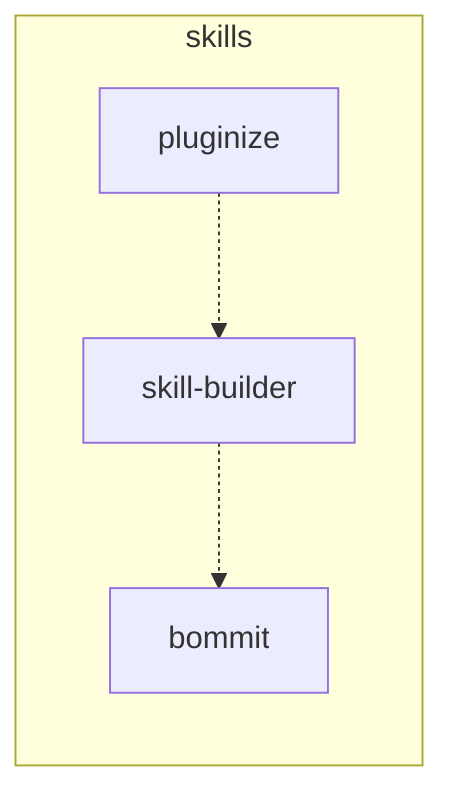

# dependency-graph

The Path B (Mermaid fallback) SSOT for inter-skill dependency edges in this repo, per [`skills/skill-builder/references/dependency.md`](../skills/skill-builder/references/dependency.md).

`sklock` is not currently installed for this repo, so this file is the active source of truth. If `sklock` is later adopted, mirror these edges into each skill's frontmatter and let `sklock lock` regenerate the canonical lockfile; this file then becomes a human-readable summary.

## Edge legend

| Symbol | Meaning |
|---|---|
| `-->` | Hard dependency — required at runtime; the upstream skill breaks without it |
| `-.->` | Soft reference — recommended/routed-to but not required for execution |

## Graph

## Skill table

| Skill | Purpose | Depends on | Used by |
|---|---|---|---|
| `bommit` | Commit the current diff with a clean conventional message | (none) | `skill-builder` (soft) |
| `pluginize` | Turn a skills repo into a multi-platform plugin | `skill-builder` (soft) | (none) |
| `skill-builder` | Lifecycle meta-skill (CREATE → SCAFFOLD → ITERATE → EVALS → AUTO-DEPS → AUTO-SPLIT → SCHEDULE) | `bommit` (soft) | `pluginize` (soft) |

## Edge evidence

- `pluginize -.-> skill-builder` — `skills/pluginize/SKILL.md` line 21 routes single-SKILL.md authoring to `skill-builder` in its **Do not trigger** boundary. Recommendation only, not a runtime call.
- `skill-builder -.-> bommit` — `skills/skill-builder/references/iteration.md` lines 30–31 and 196–204 recommend `bommit` for commit conventions. The skill itself runs without `bommit` (any commit tool works); the edge is documentation-grade.

## Maintenance

When this graph changes:

1. Update the Mermaid block above.
2. Update the skill table.
3. Add a one-line entry under "Edge evidence" with the file + line that justified the edge.
4. If a hard edge (`-->`) is added, also reflect it in the upstream skill's `## Requirements` block (RFC 2119 `MUST`).

When `sklock` is adopted later (per [`dependency.md` Path A](../skills/skill-builder/references/dependency.md#path-a--sklock)), declare the same edges in each skill's frontmatter `requires:` block and treat `sklock lock` output as the new SSOT; this file should then either be deleted or kept as a human-readable summary regenerated from the lockfile.
