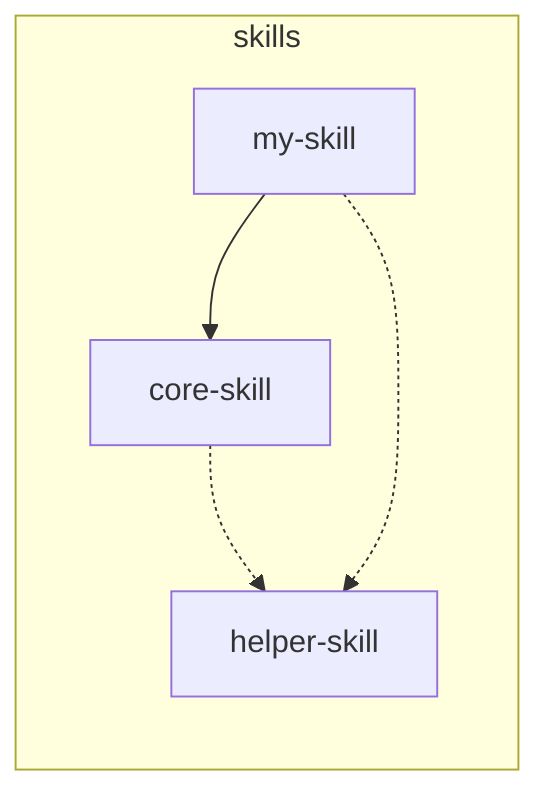

# dependency — auto-detection and registration protocol

## Overview

Scan a SKILL.md for references to other skill names, detect dependency edges, and register them.

**Two paths depending on tooling available:**

| Condition | Path |
|---|---|
| `sklock` CLI available (global or via `npx github:artieax/sklock`) | **Path A** — `SKILL.md` frontmatter + sklock CLI |
| `sklock` not available | **Path B** — Mermaid in `dependency-graph.md` |

Check with: `(command -v sklock >/dev/null 2>&1 && sklock --version) || npx github:artieax/sklock --version` — if that fails, use Path B.

---

## Path A — sklock

See [artieax/sklock](https://github.com/artieax/sklock) for install instructions, frontmatter spec, and CLI commands.

---

## Path B — Mermaid fallback

Use when `sklock` is not installed. The SSOT is `<repo-root>/references/dependency-graph.md` (or your project's equivalent). For this repo specifically, that file lives at [`/references/dependency-graph.md`](../../../references/dependency-graph.md) and currently records the edges `pluginize -.-> skill-builder` and `skill-builder -.-> bommit`.

### Dependency types

| Symbol | Meaning | Example |
|---|---|---|
| `-->` | Hard dependency | called at runtime — breaks without it |
| `-.->` | Soft reference | recommended but not required |

**Decision rule**:
- Skill name appears inside a Workflow step as an executed command → `-->`
- Skill name appears in Red flags / Output as a recommendation → `-.->` 

### Auto-detection flow

> **Skill-name contract.** The shell pipeline below assumes every directory
> under `skills/` is a **kebab-case identifier** — i.e. matches
> `^[a-z][a-z0-9-]*$`. Names containing regex metacharacters (`+`, `.`,
> `[`, `(`, `|`, `*`, `?`, `\`) would be spliced into the regex unescaped
> and either widen or break detection. If you ever need to support a
> name that doesn't fit this shape, switch to the Python form below
> (which uses `re.escape`) instead of extending the shell pipeline.

```bash
# Step 1: get all existing skill names, excluding the skill being scanned
CURRENT_SKILL="<name>"
ls skills/

# Step 2: build a word-boundary-safe regex that excludes self-references,
# then scan the new SKILL.md for references to other skills.
# `grep -E '^[a-z][a-z0-9-]*$'` enforces the kebab-case contract above
# so a stray non-conforming directory never lands in the alternation.
SKILL_NAMES_REGEX="$(ls skills/ \
  | grep -E '^[a-z][a-z0-9-]*$' \
  | grep -v "^${CURRENT_SKILL}$" \
  | paste -sd'|' -)"

# Empty-alternation guard. When CURRENT_SKILL is the *only* skill in the
# repo, SKILL_NAMES_REGEX="" and the inner `(...)` becomes an empty
# alternation that matches every position on every line — flooding the
# output with false positives. Bail out early instead.
if [ -z "$SKILL_NAMES_REGEX" ]; then
  echo "No other skills to scan."
  exit 0
fi

grep -En "(^|[^a-zA-Z0-9_-])(${SKILL_NAMES_REGEX})([^a-zA-Z0-9_-]|$)" \
  "skills/${CURRENT_SKILL}/SKILL.md"
# -E: extended regex  -n: show line numbers for evidence
# The (^|[^a-zA-Z0-9_-])...([^a-zA-Z0-9_-]|$) guards prevent substring matches
# (e.g. "skill-builder" matching inside "skill-builder-v2")
```

#### Python equivalent (use when names may contain regex metacharacters)

The shell pipeline above is only safe under the kebab-case contract. For
heterogeneous repos, use the Python form — it `re.escape`s every name
before joining, so `foo+bar`, `foo.bar`, etc. cannot widen the regex:

```python
import re
import sys
from pathlib import Path

CURRENT_SKILL = "<name>"
skills_dir = Path("skills")
others = [
    p.name for p in skills_dir.iterdir()
    if p.is_dir() and p.name != CURRENT_SKILL and (p / "SKILL.md").exists()
]

# Empty-alternation guard. With no other skills, "|".join([]) returns ""
# and the inner `(...)` becomes an empty alternation that matches every
# position on every line. Bail out before compiling the regex so we
# never report false positives in a single-skill repo.
if not others:
    print("No other skills to scan.")
    sys.exit(0)

# re.escape() makes every name a literal — even ones containing regex
# metacharacters like + . [ ( | * ? \ — so the alternation cannot widen.
alt = "|".join(re.escape(n) for n in others)
pattern = re.compile(rf"(^|[^a-zA-Z0-9_-])({alt})([^a-zA-Z0-9_-]|$)")

skill_md = (skills_dir / CURRENT_SKILL / "SKILL.md").read_text(encoding="utf-8")
for i, line in enumerate(skill_md.splitlines(), 1):
    if pattern.search(line):
        print(f"{i}: {line}")
```

Propose detected edges:

```
Detected new dependency edges:

  my-skill -.-> helper-skill
    Evidence: SKILL.md line 82 — "recommended: use helper-skill for release flow"

  my-skill --> core-skill
    Evidence: SKILL.md line 45 — "run core-skill as a required build step"

Add to dependency-graph.md? [Y/n]
```

### Updating dependency-graph.md

Target file: `<repo-root>/references/dependency-graph.md` (or your project's equivalent dependency graph file).
Drop a Mermaid block in like this (the outer fence here uses **four** backticks so the inner ` ```mermaid ` block doesn't close it early — when you copy this into `dependency-graph.md` itself, replace the outer four-backtick fence with three):

````markdown

````

Update the skill table in the same file:

| Skill | Purpose | Depends on | Used by |
|---|---|---|---|
| `my-skill` | ... | core-skill (hard), helper-skill (soft) | none |

---

## Safety checks (both paths)

### Before deletion

Verify the skill is not depended on:

```bash
# Path A
sklock why <skill-name>

# Path B
grep "<skill-name>" <repo-root>/references/dependency-graph.md
```

If dependents remain, fix them first.

### Renaming a skill (breaking change)

1. `grep` for the old name in all other `SKILL.md` files (body and frontmatter)
2. Update every reference
3. Rename the skill directory (and optional frontmatter `id`) for Path A, or update the Mermaid node name (Path B)
4. Re-run `sklock lock` (Path A) or update dependency-graph.md (Path B)
5. Bundle all changes into one commit

### Preventing circular dependencies

Do not create A → B → A cycles.

```bash
# Path A — sklock detects cycles during validate
sklock validate

# Path B — manual check
grep -E "^  [a-z-]+ -->" <repo-root>/references/dependency-graph.md
```

If a cycle is found: downgrade one `-->` to `-.->`, or extract shared logic into a new skill.
